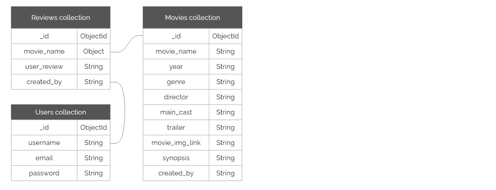
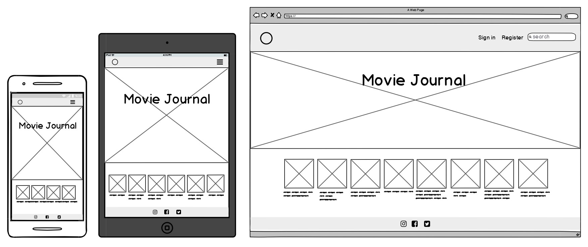
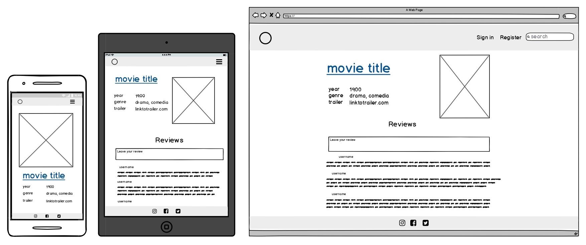
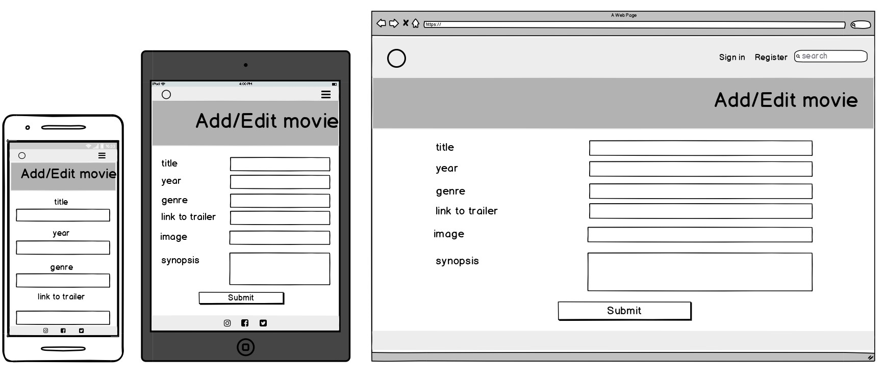
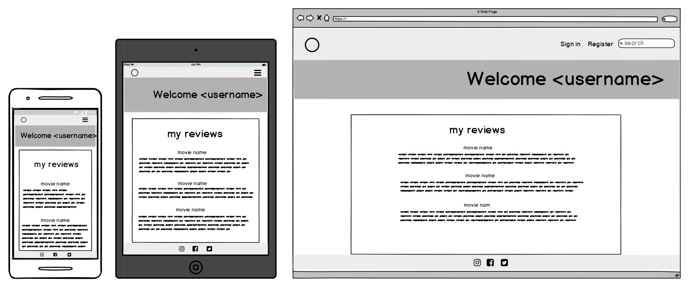

# Movie Journal

Movie Journal is the place where you can keep track of your favourite (and least favourite) movies by leaving reviews.
 
You can visit the deployed website [here](https://ms3-fernanda.herokuapp.com/).
 
---
 
## 1. UX
 
### 1.1. Project Goals
The project's main goal is to have a place where registered users can create, read, update and delete movie reviews.

- They can create a review by clicking on any movie
- They can read a review by clicking on any movie. This can be done by unregistered users as well
- They can update a review by clicking 'edit' on the review in their *Profile Page*
- They can delete a review by clicking 'delete' on the review in their *Profile Page*
 
### 1.2. User Stories
###### General Users
- As a user, I want to immediately understand the purpose of the site.
- As a user, I want to be able to see reviews that other users have created about a movie.
- As a user, I want to be able to search for a movie.
- As a user, I want to be able to suggest new movies to add to the database.
- As a user, I want to see a picture next to the movie title so I can recognise the movie quickly.
- As a user, I want to be able to register easily.

###### Registered Users
- As a registered user, I want to be able to write a review about a movie.
- As a registered user, I want to be able to edit or delete a review I created.
- As a registered user, I want to receive feedback when I made a change successfully.

###### Project Owner / Admin
- As the project owner, I want to be able to add, read, update, and delete movies from the database.
- As the project owner, I want to be able to receive feedback from users so I can add new movies to the database.

### 1.3. Design Choices
- **Fonts**: I chose Raleway as I feel it was an aesthetic and readable font. To emphasize some headers I used Londrina Shadow, since it gave me the feel of a hand drawn header in a diary. Both fonts were imported from [Google Fonts](https://fonts.google.com/)
- **Movie Posters**: When adding the image of a movie to the database, I filtered the search by usage rights: *Free to share and use*
- **Colours**: to keep consistency through the project, I first selected an [image](https://www.freepik.com/free-vector/retro-background-with-film-camera_1023417.htm#page=2&query=movie+background&position=30) to be the main image in the *home page*  and from that image I created the colour palette.
 

### 1.4. Information Architecture
MongoDB was used for this projec project. There are three collections in the database: 

### 1.5. Wireframes
The wireframes were designed using [Balsamiq](https://balsamiq.com/). They're accessible in the following links:
 
|    Home Page   |    Display Movie    |    Add/Edit Movie    |    Profile Page    |
|     :----:     |        :----:       |        :----:        |        :----:      |
|||||

---
 
## 2. Features

### 2.1. CRUD functionality
All users can:
- view all movies
- view all movie reviews

Registered users can:
- Add, edit and delete their movie reviews

The admin can:
- Add, edit and delete their movie reviews
- Add, edit and delete movies to the database

### 2.2. Existing Features
 
**Site wide**:
- **NavBar**: gives consistency and allow users to navigate the page easily. This includes:
-- **Project's logo**: allows users to identify where they are.
-- **Navigation Menu**: allows users to navigate the site in an easy and intuitive way.
-- **Search Bar**: allows users to search for a movie. This redirects the user to the **Search Results Page**.

**Search Results Page**:
- **Results**: shows the users the results for their search. If no results are found, the user gets a Suggestion Form
- **Suggestion Form**: allows users to participate in the project by sending movie suggestions that the Admin can add to the database.

**Home Page**:
- **Page Title**: allows users to identify the project's purpose.
- **Movies**: allows users to see the movies in the database (latests=?????). To see more informationa about a specific movie the user can click on the **+** button on any movie and this redirects the user to the **Movie Page**.
- **Suggestion Form**: allows users to participate in the project by sending movie suggestions that the Admin can add to the database.

**Movie Page**:
- **Movie Information**: allows users to know more about a specific movie. Every Movie Page includes:
-- **Movie Title**
-- **Movie Poster**
-- **Year**
-- **Genre**
-- **Director**
-- **Main Cast**
-- **Link to Trailer**
-- **Synopsis**
- **Reviews Section**: allows users to see the reviews for that movie. It also allows registered users to leave their own reviews about that movie.

**Register Page**:
 - **Registration Form**: allows users to sign up by providing some information.
 
 **Log In Page**:
 - **Log In Form**: allows users to log in with the information they provided in their registration form.
 
### 2.3. Potential Features
Some futures that I would like to implement in the future are:
- A rating system for users to vote which movie they liked the most.
- A watchlist for users to add the movies they want to watch or they already watched.
- A random movie option that randomly selects a movie from the database and recommends it to the user.
- An Edit and delete profile option

---
 
## 3. Technologies used
#### Languages
- [HTML5](https://html.com/) provides the content and structure for the project.
- [CSS3](http://www.css3.info/) provides the styling.
- [JavaScript](https://www.javascript.com/) provides the functionality and interaction.
- [Python](https://www.python.org/) provides the backend for the project.
- [Jinja](https://jinja.palletsprojects.com/en/2.11.x/) is used for templating Python.

#### Frameworks & Libraries
- [Bootstrap](https://getbootstrap.com/) is used to create the layout of the project and some styling.
- [jQuery](https://jquery.com/) complements JavaScript.
- [Flask](https://flask.palletsprojects.com/en/1.1.x/) is used in conjunction with the Jinja2 templating language to generate the HTML templates on the backend. It was also used to access and process the data sent from the frontend to the server.
- [Werkzeug](https://werkzeug.palletsprojects.com/en/1.0.x/) is used for password hashing and authentication.
- [Google Fonts](https://fonts.google.com/) is used to provide the fonts: Londrina Shadow and Raleway.
- [Font Awesome](https://fontawesome.com/) is used to provide some icons.

#### Project Management
- [MongoDB](https://www.mongodb.com/) is used to host the database for the project.
- [Git](https://git-scm.com/) is used for version control.
- [GitHub](https://github.com/) is used to host the project.
- [Heroku](https://www.heroku.com/) is used to deploy the app.
- [Gitpod](https://gitpod.io/) was used to develop the website.

#### Design
- [Balsamiq](https://balsamiq.com/) was used to create the project's wireframes.
- [HTML Color Codes](https://html-color-codes.info/) was used to select colours codes from an image to create the website's colour palette.
- [Pixabay](https://pixabay.com/) and [Freepik](https://www.freepik.com/) were used to get images for the project.
- [TinyJPG](https://tinyjpg.com/) was used to compress the size of the images.
- [Favicon](https://www.favicon-generator.org//) was used to create the icon.

#### Testing
- [Chrome Developer Tools](https://developers.google.com/web/tools/chrome-devtools) was used to test the responsiveness of the site.
- [Am I Responsive?](http://ami.responsivedesign.is/) was used to test the responsiveness of the site.
- [Autoprefixer](https://autoprefixer.github.io/) was used to parsethe CSS and to add vendor prefixes to CSS rules.
- [W3C HTML Validator](https://validator.w3.org/) was used to check the HTML code for any errors.
- [W3C CSS Validator](https://jigsaw.w3.org/css-validator/) was used to check the CSS code for any errors.
- [JS Hint](https://jshint.com/) was used to check the JavaScript code for any errors.
- [PEP8](http://pep8online.com/) was used to check the Python code for any errors.

---
 
## 4. Testing
 
The testing process can be seen [here](TESTING.md).
 
---
 
## 5. Deployment
 
###### Heroku deployment

Heroku needs some application and dependencies to run the app
1. Create a **requirements.txt** file using the terminal command  `pip freeze > requirements.txt`.
2. Create a **Procfile** with the terminal command  `echo web: python app.py > Procfile`.
3. Push these files to GitHub

*The Procfile might add a blank line at the bottom, and sometimes this can cause problems when running our app on Heroku, so just delete that line and save the file.

4. Go to [Heroku](https://www.heroku.com/) and once you're logged in on your dashboard, click on the **New** button and there click **Create a New App**.
5. Give the new app a name and set the region closest to you, then click the **Create App** 
6. This will take you to the **Deploy** tab of your newly created app. There go to **Deployment method** and select **GitHub**. 
7. In **Connect to GitHub**, search for your repository and click **Connect** to connect it to this app.
8. In the Heroku dashboard for the app, go to **Settings**, and then scroll down and click on **Reveal Config Vars**. Set the following config vars:

|  Key  |  Value  |
| :-------------: | :-------------: |
|  IP |  0.0.0.0  |
|  PORT  |  5000  |
|  SECRET_KEY  |  `<your_secret_key>`  |
|  MONGO_URI  | mongodb+srv://`<username>`:`<password>`@`<cluster_name>`-qtxun.mongodb.net/`<database_name>`?retryWrites=true&w=majority  |
|  MONGO_DBNAME  |  `<database name>`  |

9. In the Heroku dashboard for the app, go to **Deploy**, scroll down and click on **Enable Automatic Deployment**
10. Below that select the branch that you want to deploy (in this case *master*) and click **Deploy Branch**
11. Once that’s done, you can click **View** to launch your app

---
 
## 6. Credits
 
### 6.1. Content
The project's main code is based on the Code Institute Task Manger Mini-Project by [Tim Nelson](https://github.com/TravelTimN).

The functionality for the *show more*/*show less* button is based in [this article](https://www.viralpatel.net/dynamically-shortened-text-show-more-link-jquery/) from Viralpatel.net.
 
I took inspiration from [Juan Stelling](https://github.com/juanstelling/MS3_breaktasty) for the error handlers.
### 6.2. Media
 
### 6.1. Acknowledgments
