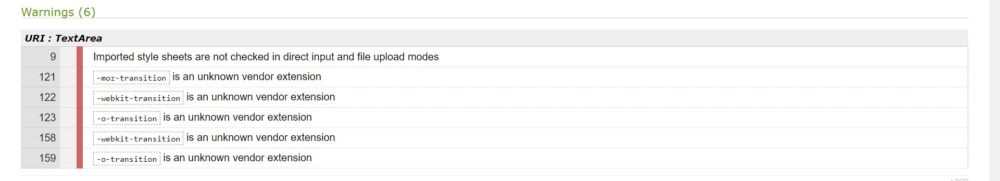

# Testing

- <a href="#1">1. Code Validators</a>
- <a href="#2">2. Responsiveness</a>
- <a href="#3">3. Browser Compatibility</a>
- <a href="#4">4. User Stories</a>
- <a href="#5">5. Bugs</a>

---

## 1. Code validators

### [HTML Validator](https://validator.w3.org/) : 
While testing the HTML code, I had some errors related to Jinja templating. These errors were omitted for the correct functioning of the site. Some examples:

Apart from these, the test returned some errors and warnings not related to Jinja: 

###### Movie Page
After passing the page through the HTML Validator, and after checking for non Jinja related errors, this 
 tag related error was found. 
When I went to the code to fix the error I saw that the opening 
 tag was actually there, so this error was ignored.

###### Add New Movie Page and Edit Movie Page
This two pages returned the same errors since it was the same form, just adjusted for each site needs.

- The h4, maxlength and minlegth related error were fixed by ommiting them since they weren't necessary for the correct functioning of the site nor didn't affect the styling.
- The for attribute related errors were fixed by including the missing ID element in the <input> field below the <labels>.

### [CSS Validator](https://jigsaw.w3.org/css-validator/) : 
The test returned two errors and some warnings. 

- The warnings were related to browser cross-compatibility and they were ignored in order to have the content render properly on every browser.

- The first one was solved removing the class since it wasn't necessary.
- The second one was solved adjusting the padding to `padding: 1.1rem 0.2rem;` instead.

#### [JSHint JavaScript Validator](https://jshint.com/) :
The test returned two type of warnings:
- one undefined variable 
- two unused variables: this is a function called from outside the **script.js** file

### [PEP8 Python Validator](http://pep8online.com/) : 
The test returned some errors and warnings. All of them were fixed following the recommendations.

---

## 2. Responsiveness
To test the responsiveness of the site I used [Chrome DevTools](https://developers.google.com/web/tools/chrome-devtools) and [Responsive Design Checker](https://www.responsivedesignchecker.com/).
I also asked some family members and friends to test it on their devices.

---

## 3. Browser compatibility

---

## 4. User Stories

###### General Users
- As a user, I want to immediately understand the purpose of the site.
    - The project has a general cinematic look: the main page background suggests it, the movies miniatures places in like a movie roll and both the logo and favicon is a camera.
    - When the user first sees the page, they see the name (*Movie Journal*) and the *search bar* that immediately makes the user realise the general purpose of the project.
- As a user, I want to be able to see reviews that other users have created about a movie.
    - The user can click on any movie and see the reviews left for that movie. If they're looking for a specific movie they can use the *search bar*.
- As a user, I want to be able to search for a movie to see its reviews.
    - The *search bar* is very accesible: there is one *search bar* on the navbar on every page, there is one *search bar* in the main page as a call to action. 
    - If the user registers or log in, they can find another *search bar* in the profile page.
- As a user, I want to be able to suggest new movies to add to the database.
    - There is a *suggestion form* placed at the bottom of the *home page* to send a movie suggestion. 
    - When the user searches for a particular movie, if that movie doesn't exist in the database yet, they also get a *suggestion form*.
- As a user, I want to see a picture next to the movie title so I can recognise the movie quickly.
    - There movie miniatures are styled in a way that for each movie there is an image. These images are big enough (but not too big) for the user to be able to find a movie with just a quick look.
- As a user, I want to be able to register easily.
    - The *registration form* is a simple form that includes only the basics to make it secure: username, email and password.

###### Registered Users
- As a registered user, I want to be able to write a review about a movie.
    - The user can easily review any movie by clicking on them and scrolling down to the *reviews section* section
- As a registered user, I want to be able to edit or delete a review I created.
    - The easiest way for the users to find a review they wrote is to go to their *profile page*. There they can find all the reviews they've written in Movie Journal and edit or delete them.
    - Another way of editing or deleting a review is directly in the movie page.
- As a registered user, I want to receive feedback when I made a change successfully.
    - There are several flash messages that pop up after the user has made a change. For example: after adding a new review, after editing or deleting a review, if the registration was successful, or if the sername already exists.
    - Also, when the user registers, the receive an email confirmating this.

###### Project Owner / Admin
- As the project owner, I want to be able to add, read, update, and delete movies from the database.
    - The Admin user is the only one that can add, edit and delete movies:
        - To add a movie they can click on *Add New Movie* in the navbar. 
        - To edit or delete a movie the admin can click on any movie. On the top right, there are an *edit* and a *delete* button that only show to the admin. 

- As the project owner, I want to be able to receive feedback from users so I can add new movies to the database.
    - When a user fills in the *suggestion form*, the admin receives an email with that information.

---

## 5. Bugs

- When creating the add a new movie functionality, at first I could add a new movie to the database, but when clicking on any created movie, no matter which one, it would only show the first movie added to the databse.
I wondered if the information wasn't being saved in the database, but when checking on mongodb, I could see that the information was saved properly.
    - With help from Code Institut Tutor Team, we found that I wasn't linking each movie id properly, since I had it on the '+' button (the one that leads to the movie modal), but not on the modal itself. 
    This was solved and I also moved the movie modal to a page for better UX.

- Since I store the movie id as an object in the reviews database, I had an issue retrieving just the movie name from it. 
    - After talking to the Tutor team, I found out that the best way to get that information from inside the *reviews* collection in MongoDB was to use dot notation but going on a new level and it worked: `{{ review.movie_name.movie_name }}`.

- A friend suggested to make the images clickable for better UX on mobile. 
    - This was implemented including the  tag in every movie miniature inside an <a> link redirecting to the movie page.

---

[Go back to README.md file](README.md).